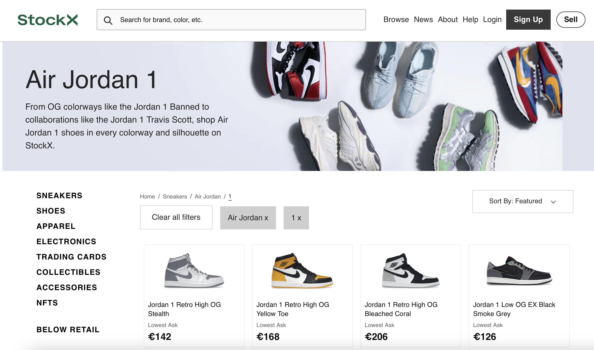
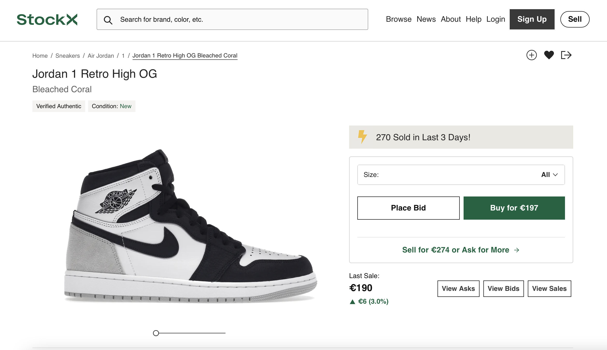

# Procesverslag
Markdown is een simpele manier om HTML te schrijven.  
Markdown cheat cheet: [Hulp bij het schrijven van Markdown](https://github.com/adam-p/markdown-here/wiki/Markdown-Cheatsheet).

Nb. De standaardstructuur en de spartaanse opmaak van de README.md zijn helemaal prima. Het gaat om de inhoud van je procesverslag. Besteedt de tijd voor pracht en praal aan je website.

Nb. Door *open* toe te voegen aan een *details* element kun je deze standaard open zetten. Fijn om dat steeds voor de relevante stuk(ken) te doen.

## Jij

  
uitwerken voor kick-off werkgroep

  ### Auteur:
  Nathan Stuger

  #### Je startniveau:
  hier je startniveau Blauw

  #### Je focus:
  hier je focus: Een site maken waarbij ik elk onderdeel van de code begrijp en als ik hulp heb gehad dit zelf kunnen reproduceren. Mijn grooste eis is comfortabel worden met het schrijven van code.

## Je website

  
uitwerken voor kick-off werkgroep

  ### Je opdracht:
  https://stockx.com/air-jordan-1-retro-high-og-stage-haze

  #### Screenshot(s) van de eerste pagina (small screen):
  Air jordan 1   
  

  #### Screenshot(s) van de tweede pagina (small screen):
  Air Jordan 1 Retro high OG Bleached Coral  
  

## Toegankelijkheidstest 1/2 (week 1)

  
uitwerken na test in 1e werkgroep

  ### Bevindingen
  Lijst met je bevindingen die in de test naar voren kwamen:

  #### Screenreader
  Er zijn een aantal elementen met een te lange of niet relevante naam.
  
  Deze namen zijn onnodig lang en niet duidelijk, dit gaat bijvoorbeeld om een type schoen. Dit kan veel korter en duidelijker worden beschreven. 

  #### Muis en Toetsenbord
  Hier korte omschrijving (met indien nodig afbeeldingen)

  Hier een omschrijving van hoe het opgelost kan worden (met indien nodig afbeeldingen)

  #### Motoriek (shocks, elastiekjes)
  Hier korte omschrijving (met indien nodig afbeeldingen)
  De website is vrij eenvoudig in elkaar gezet hierdoor kan je best goed navigeren.

  Hier een omschrijving van hoe het opgelost kan worden (met indien nodig afbeeldingen)

  #### Visueel (brillen, contrast, kleurenblind, dark/light).
  Hier korte omschrijving (met indien nodig afbeeldingen)

  Hier een omschrijving van hoe het opgelost kan worden (met indien nodig afbeeldingen)

## Breakdownschets (week 1)

  
uitwerken na afloop 2e werkgroep

  ### de hele pagina:
  

  ### dynamisch deel (bijv menu):
  

  ### wellicht nog een dynamisch deel (bijv filter):
  

## Voortgang 1 (week 2)

  
uitwerken voor 1e voortgang

  ### Stand van zaken
 Dit was het eerste voortgang gesprek, ik had hier nog niet veel code en had de breakdown schets niet helemaal juist toegepast. 

  ### Agenda voor meeting
  We hadden allemaal verschillende punten die willen over de breakdown schetsen.

  | student 1      | student 2          | student 3    | student 4        |
  | ---            | ---                | ---          | ---              |
  | dit bespreken  | en dit             | en ik dit    | en dan ik dat    |
  | en dat ook nog | dit als er tijd is | nog een punt | dit wil ik zeker |
  | ...            | ...                | ...          | ...              |

  ### Verslag van meeting
  Ik ben goed geholpen door Jeffrey, hij heeft een paar sterke tips gegeven over de manier waarop ik mijn site kan indelen (de structuur) en waarom bepaalde aspecten die ik nu heb beter kunnen. 

  

## Voortgang 2 (week 3)

  
uitwerken voor 2e voortgang

  ### Stand van zaken
  hier dit ging goed & dit was lastig (neem ook screenshots op van delen van je website en code)

  ### Agenda voor meeting
  samen met je groepje opstellen

  | student 1      | student 2          | student 3    | student 4        |
  | ---            | ---                | ---          | ---              |
  | dit bespreken  | en dit             | en ik dit    | en dan ik dat    |
  | en dat ook nog | dit als er tijd is | nog een punt | dit wil ik zeker |
  | ...            | ...                | ...          | ...              |

  ### Verslag van meeting
  hier na afloop snel de uitkomsten van de meeting vastleggen

  - punt 1
  - punt 2
  - nog een punt
- ...

## Toegankelijkheidstest 2/2 (week 4)

  
uitwerken na test in 8e werkgroep

  ### Bevindingen
  Lijst met je bevindingen die in de test naar voren kwamen (geef ook aan wat er verbeterd is):

  #### Screenreader
  Hier korte omschrijving (met indien nodig afbeeldingen)

  Hier een omschrijving van hoe het opgelost kan worden (met indien nodig afbeeldingen)

  #### Muis en Toetsenbord
  Hier korte omschrijving (met indien nodig afbeeldingen)

  Hier een omschrijving van hoe het opgelost kan worden (met indien nodig afbeeldingen)

  #### Motoriek (shocks, elastiekjes)
  Hier korte omschrijving (met indien nodig afbeeldingen)

  Hier een omschrijving van hoe het opgelost kan worden (met indien nodig afbeeldingen)

  #### Visueel (brillen, contrast, kleurenblind, dark/light).
  Hier korte omschrijving (met indien nodig afbeeldingen)

  Hier een omschrijving van hoe het opgelost kan worden (met indien nodig afbeeldingen)

## Voortgang 3 (week 4)

  
uitwerken voor 3e voortgang

  ### Stand van zaken
 Ik ben veel meer op mijn gemak met het schrijven van code. Dit was eerste iets waar ik tegen op keek maar het begint steeds aangenamer te worden(Denk ook dat dit komt omdat het lukt!)
 
 Er blijven wel bepaalde elementen die ik nog steeds lastig vind:
 
 Eerste punt: De afstand tussen de regels tekst binnen het schoenen kader, ik zou deze graag willen verkleinen op de juiste manier. (waarschijnlijk met margin of padding maar kan dit ook anders?)
 
 Het tweede punt: het gebruiken van de mediaQ, Ik heb door hoe het werkt en heb ook een hoop aangepast. Ik heb alleen het gevoel dat dit veel efficienter en overzichtelijker kan. 
 
 Een voorbeeld, het menu hoort te veranderen naar een hamburger menu vanaf een bepaalde grote, is het dan de bedoeling om de delen van de nav die niet terug komen op "display none" te zetten etc.
 
 Mijn derde punt: De werking van de buttons en filters: is het de bedoeling dat het filter op de rechterkant van de pagina werkt zoals op de orginele site? Dit dan kan ik dit op een bepaalde manier aanpakken.

  ### Verslag van meeting
  hier na afloop snel de uitkomsten van de meeting vastleggen

  Ik kwam er tijdens dit gesprek achter dat ik al goed opweg was maar er moest inderdaad nog een hoop gebeuren. We hebben deze meeting vooral gehad over de schoenen grids en hoe ik deze het best kon aanpassen. 
  
  Daarnaast had ik wat vragen over displat flex en de bepaalde volgorde van elementen. 

## Eindgesprek (week 5)

  
uitwerken voor eindgesprek

  ### Je uitkomst - karakteristiek screenshots:
  
    
    
     
  
  ### Dit ging goed/Heb ik geleerd:
  Ik heb een hoop gemaakt waar ik ook echt trots op ben, het zullen voor expers niet hele ingewikkelde stukken code zijn maar ik had echt een hele tijd niets met html gedaan. In de tussen tijd volg ik een minor waarbij ik ook moest coderen, deze manier van lesgeven heeft echt top gewerkt omdat je hierdoor constant met elkaar ingesprek gaat over elkaars code.
  
  Waar ik nu veel beter in ben geworden is het schrijven van code zonder id's en classes te gebruiken. Er zijn hier veel verschillende opties voor en ik was daar hiervoor totaal niet van op de hoogte. Hoewel ik niet alles uit mijn hoofd ken zijn er niet meer heel veel regels in CSS waar ik van zou schrikken. Op verschillende momenten in de klas heb ik gedacht "hoe kunnen andere nou zo snel op antwoorden komen als deze worden gevraagd" Ik zou nu heel anders in deze lessen zitten!
  
  
  

  ### Dit was lastig/Is niet gelukt:
  Dit was best moelijk voor mij er zijn namlijk een aantal dingen waar ik gewoon niet te vreden over ben. Als eerst wil ik beginnen met de tweede pagina. Pagina 1 heeft echt 80% van mijn aandacht gekost waardoor de tweede pagina niet zo ver is als ik deze graag had willen zien. Hier baal ik van omdat deze pagina juist invoudiger is om te maken. Ik had mijn tijd vanaf het begin dus beter moeten verdelen. Dit is het grootste deel waar ik niet blij mee ben, daarnaast zijn er nog kleine details waar ik graag tijd aan het willen besteden om echt de puntjes op de i te zetten.
  
  Als ik dit vak ook klassiekaal had kunnen meemaken weet ik zeker dat ik veel minder tijd had besteed in het zoeken naar elementen en manieren om deze te gerbuiken. 
  
  

## Bronnenlijst

  
continu bijhouden terwijl je werkt

  Nb. Wees specifiek ('css-tricks' als bron is bijv. niet specifiek genoeg).

  1.Dit was een erg handige manier om meer te leren over grid of om te kijken waarom iets niet werkt: 
  Link:https://css-tricks.com/snippets/css/complete-guide-grid/#aa-grid-properties 
  
  2.Net zoals de vorige bron heb ik super veel gehad aan deze pagina: 
  Link:https://developer.mozilla.org/en-US/docs/Web/CSS/CSS_Flexible_Box_Layout/Basic_Concepts_of_Flexbox
  
  3.Ik had mijn icons eerst toegeveoegd door een google icon link, ik kreeg als advies om deze te veranderen in png of svg afbeeldingen ik was niet helemaal hoe dit moest daar was deze link perfect voor  : 
  Link:https://developer.mozilla.org/en-US/docs/Web/CSS/background-image
  
  

